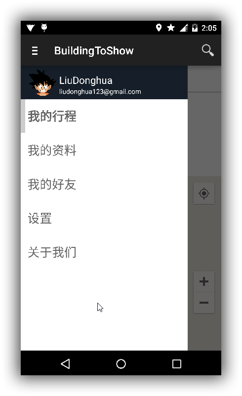
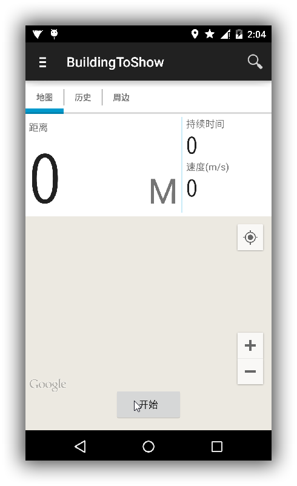

#Building To Show#
===========================================

健身助手客户端
目前这还是一个非常初始版本，仅实现记录行程线路、距离、速度等信息，后面预期添加如查看好友位置，配合服务端推送一些个性健身咨询等内容。

###项目初始框架界面如下图所示###

####向右划出的侧边栏布局####

####我的行程主界面####

###主要功能###
* 使用Google Map API定位当前位置，点击开始即可记录跑步/散步等移动行程线路及当前所用时间及速度（其准确度与所使用手机的GPS或网络定位有关），结束点击相应按钮即可保存记录
* 可在历史Tab中查看之前已保存过的历史记录

###目前需要添加或改进的特性###
* 由于国内Google服务器经常被屏蔽，不稳定，所以使用Baidu Map API替换，见master_baidu_map分支（目前仅完成部分）
* 在历史Tab中使用Android 5.0提供的原生RecyclerView，CardView替代JazzyListView，提供更好的Material Design交互
* 完成其余功能的开发